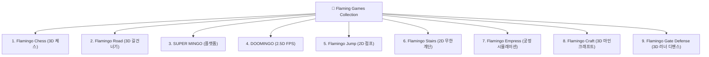

# 🦩 Flaming Games (플라밍고 레트로 2D/3D 게임 컬렉션)

> **대한민국의 1인 인디 해커 및 게임 개발자를 위한 플라밍고 컨셉의 레트로 2D/3D 웹 게임 컬렉션 통합 저장소입니다.**  
> Chiptune WebAudio 사운드, 절차적 픽셀 아트, Three.js 3D 복셀 렌더러 등 외부 에셋 없이 순수 웹 브라우저 기술로만 설계된 9가지 시그니처 플라밍고 게임들이 수록되어 있습니다.

---

## 🎮 게임 목록 및 플레이 링크 (Games Collection)

본 저장소의 모든 게임은 **GitHub Pages**를 통해 각 서브경로에서 별도의 설치 없이 즉시 실행 가능합니다.

### 1. ♟️ [Flamingo Chess](./flamingo-chess)
* **장르**: Babylon.js PBR 3D 체스 게임 (플라밍고 vs 흑조, 싱글 플레이 턴제)
* **🔗 플레이 하기**: **[Flamingo Chess 플레이](https://flam-ing.github.io/flaming-games/flamingo-chess/)**

### 2. 🚗 [Flamingo Road](./flamingo-road)
* **장르**: 3D 복셀 길건너기 어드벤처 게임 (Three.js / Crossy Road 느낌)
* **🔗 플레이 하기**: **[Flamingo Road 플레이](https://flam-ing.github.io/flaming-games/flamingo-road/)**

### 3. 🍄 [SUPER MINGO](./super-mingo)
* **장르**: 8비트 사이드스크롤링 플랫폼 러너 게임 (Doodle/Super Mario 느낌)
* **🔗 플레이 하기**: **[SUPER MINGO 플레이](https://flam-ing.github.io/flaming-games/super-mingo/)**

### 4. 🔫 [DOOMINGO](./doomingo)
* **장르**: 2.5D 레이캐스팅 레트로 FPS 슈터 게임 (Doom 95 느낌)
* **🔗 플레이 하기**: **[DOOMINGO 플레이](https://flam-ing.github.io/flaming-games/doomingo/)**

### 5. 🦘 [Flamingo Jump](./flamingo-jump)
* **장르**: 2D 캔버스 수직 점프 게임 (Doodle Jump 느낌)
* **🔗 플레이 하기**: **[Flamingo Jump 플레이](https://flam-ing.github.io/flaming-games/flamingo-jump/)**

### 6. 🪜 [Flamingo Stairs](./flamingo-stairs)
* **장르**: 2D 캔버스 순발력 계단 오르기 게임 (무한의 계단 느낌)
* **🔗 플레이 하기**: **[Flamingo Stairs 플레이](https://flam-ing.github.io/flaming-games/flamingo-stairs/)**

### 7. 👑 [Flamingo Empress](./flamingo-empress)
* **장르**: 턴제 궁정 라이프 시뮬레이션 (성세천하 오마주)
* **🔗 플레이 하기**: **[Flamingo Empress 플레이](https://flam-ing.github.io/flaming-games/flamingo-empress/)**

### 8. ⛏️ [Flamingo Craft](./flamingo-craft)
* **장르**: 3D 복셀 절차적 월드 생성 샌드박스 (Three.js / Minecraft 느낌)
* **🔗 플레이 하기**: **[Flamingo Craft 플레이](https://flam-ing.github.io/flaming-games/flamingo-craft/)**

### 9. 🛡️ [Flamingo Gate Defense](./flamingo-gate-defense)
* **장르**: 3D 수학 관문 크라우드 러너 디펜스 (Three.js / Count Masters 느낌)
* **🔗 플레이 하기**: **[Flamingo Gate Defense 플레이](https://flam-ing.github.io/flaming-games/flamingo-gate-defense/)**

---

## 🛠️ 기술적 특징 (Technical Highlights)

* **의존성 Zero**: 외부 이미지/오디오 에셋 파일 없이 Web Canvas API 및 WebAudio API 합성 기법 위주로 제작되어 로딩 속도가 극도로 빠릅니다.
* **크로스 플랫폼 모바일 대응**: 모든 게임은 데스크톱 키보드 조작 외에 모바일 화면 터치 및 버추얼 조이스틱 D-Pad 조작을 기본 탑재하고 있습니다.
* **정적 호스팅 최적화**: Webpack/Vite 등의 복잡한 빌드 과정 없이 GitHub Pages 또는 Cloudflare Pages로 즉시 서브경로 호스팅 배포가 가능합니다.

---

## 📄 라이선스 (License)

본 게임 컬렉션 패키지는 **[MIT License](LICENSE)**에 따라 오픈소스로 배포되며, 자유로운 학습, 복제 및 변형 사용이 가능합니다.
